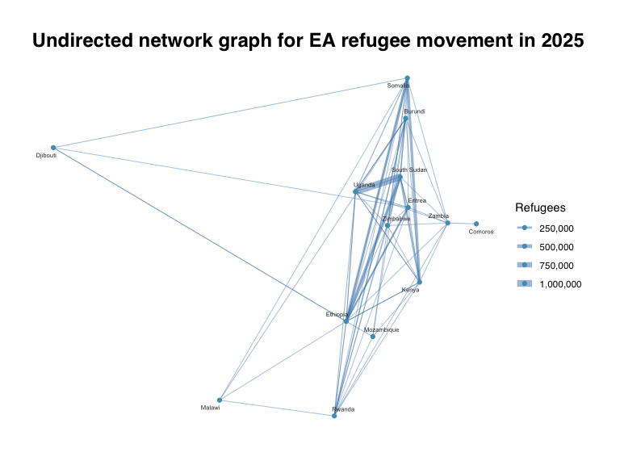
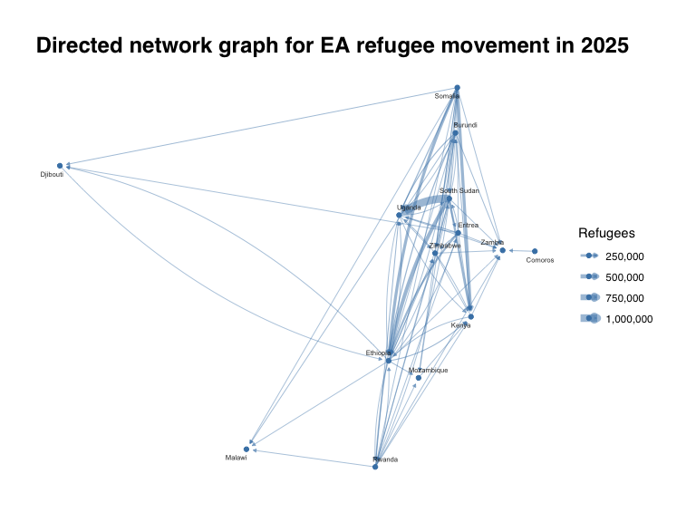
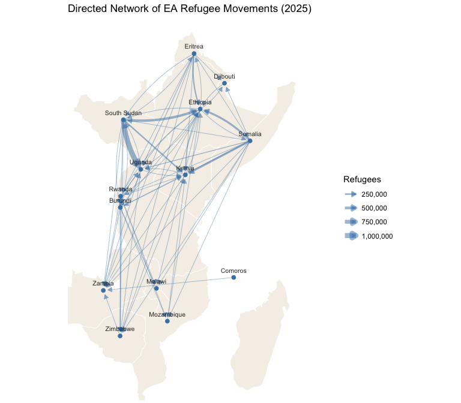
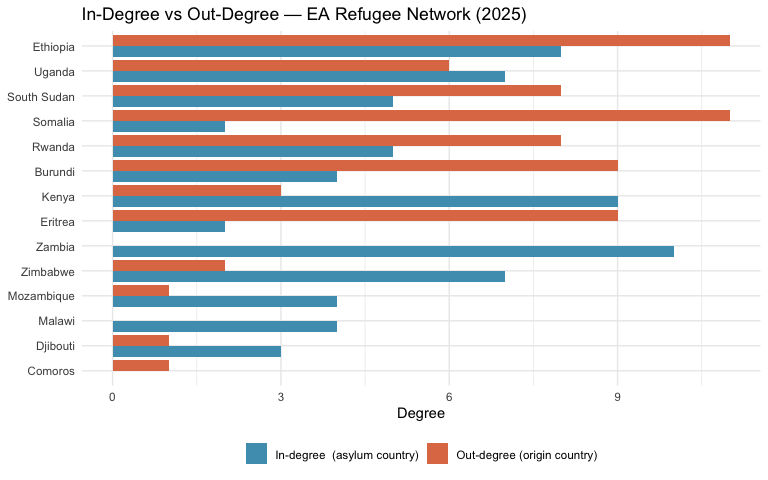

# Network-Based Disease Modelling
Okwir Julius
2026-04-02

## Introduction

Human movement is one of the most important drivers of infectious
disease spread. When people move between locations whether as refugees,
migrants, or travellers, they carry pathogens with them, creating
pathways through which diseases can jump from one population to another.
Understanding the structure of these movement pathways is therefore
essential for epidemic preparedness and response.

This tutorial uses **network analysis** to model refugee movements
across East Africa in 2025. In a movement network, each country is a
**node** and each refugee flow between two countries is an **edge**. The
number of refugees on a route is stored as the **edge weight**. By
analysing the properties of this network we can identify which countries
act as major receiving hubs, which are key senders, and which sit at
critical bridge positions through which disease would most likely pass.

**Data source:** UNHCR Persons of Concern dataset, filtered to East
African countries with at least one refugee flow in 2025.

------------------------------------------------------------------------

## Setup

### Load packages

All packages are loaded via `pacman::p_load()`, which installs any
missing packages automatically before loading them.

``` r
pacman::p_load(
  tidyverse,          # data wrangling and ggplot2
  igraph,             # network construction and metric computation
  tidygraph,          # tidy wrapper around igraph (tbl_graph objects)
  ggraph,             # network visualisation, ggplot2 style
  janitor,            # clean column names
  rnaturalearth,      # country boundary shapefiles for map backgrounds
  rnaturalearthdata,  # supporting data for rnaturalearth
  sf                  # handle spatial objects
)
```

------------------------------------------------------------------------

## Data Preparation

### Load and clean data

The raw UNHCR dataset is loaded, column names are standardised, and only
the variables needed for this analysis are retained.

``` r
data <- read_csv("persons_of_concern.csv")

# standardise column names and keep relevant variables
data <- data %>%
  clean_names() %>%
  select(year, country_of_origin, country_of_asylum, refugees, asylum_seekers)
```

### Define East African countries

The analysis is restricted to the countries of the East African region.
Refugee movements within East Africa are highly interconnected, and many
of the countries share borders where disease transmission risk is
elevated.

``` r
ea_countries <- c(
  "Burundi", "Comoros", "Djibouti", "Eritrea", "Ethiopia", "Kenya",
  "Madagascar", "Malawi", "Mauritius", "Mozambique", "Rwanda",
  "Seychelles", "Somalia", "South Sudan", "Tanzania", "Uganda",
  "Zambia", "Zimbabwe"
)
```

### Build the edge list

An **edge list** is the fundamental data structure for a network. Each
row represents one connection in this case, a refugee flow from an
origin country to an asylum country. Three filters are applied:

- Only East African countries are included in both origin and asylum
  columns
- Flows where the origin equals the asylum country are removed (no
  self-loops)
- Only the year 2025 and flows with at least one refugee are kept

The `weight` column stores the total number of refugees on each route
and will be used to scale edge thickness in the visualisations.

``` r
edges <- data %>%
  select(-asylum_seekers) %>%
  filter(
    country_of_origin %in% ea_countries,
    country_of_asylum %in% ea_countries,
    country_of_origin != country_of_asylum,  # remove self-loops
    year == 2025,
    refugees > 0
  ) %>%
  select(
    from   = country_of_origin,  # edge source (origin country)
    to     = country_of_asylum,  # edge target (asylum country)
    weight = refugees            # edge weight (number of refugees)
  )

# node table: one row per unique country in either the from or to column
nodes <- tibble(name = unique(c(edges$from, edges$to)))

glimpse(edges)  # 70 rows — one per directed flow
```

    Rows: 70
    Columns: 3
    $ from   <chr> "Burundi", "Burundi", "Burundi", "Burundi", "Burundi", "Burundi…
    $ to     <chr> "Ethiopia", "Kenya", "Malawi", "Mozambique", "Rwanda", "South S…
    $ weight <dbl> 88, 9981, 6716, 1085, 50237, 1191, 42518, 11607, 503, 5, 48, 11…

``` r
glimpse(nodes)  # 14 rows — one per country involved
```

    Rows: 14
    Columns: 1
    $ name <chr> "Burundi", "Comoros", "Djibouti", "Eritrea", "Ethiopia", "Kenya",…

The cleaned dataset contains **70 directed flows** across **14
countries**. The largest single flow is South Sudan to Uganda with over
one million refugees.

------------------------------------------------------------------------

## Network Graphs

### Undirected network

**Research question:** Which countries are connected by refugee flows at
all, regardless of direction?

An undirected graph treats movement as a mutual connection. If Burundi
to Uganda exists, the two countries are simply shown as linked. This is
useful for understanding the overall connectivity structure of the
region without worrying about which way the flow runs. Edge width is
proportional to the number of refugees on each route.

``` r
# directed = FALSE collapses A->B and B->A into one undirected edge
tg_undirected <- tbl_graph(
  nodes    = nodes,
  edges    = edges,
  directed = FALSE
)

set.seed(123)  # fix layout seed for reproducibility

ggraph(tg_undirected) +

  # straight lines; width encodes the refugee flow size
  geom_edge_link(
    aes(width = weight),
    colour = "steelblue",
    alpha  = 0.5           # transparency helps where edges overlap
  ) +

  # map edge width to a readable visual range
  scale_edge_width_continuous(
    name   = "Refugees",
    range  = c(0.3, 3),
    labels = scales::comma
  ) +

  geom_node_point(colour = "#4E9EBD", show.legend = TRUE) +

  geom_node_text(
    aes(label = name),
    size   = 2,
    repel  = TRUE,   # nudges labels apart to reduce overlap
    colour = "grey20"
  ) +

  labs(title = "Undirected network graph for EA refugee movement in 2025") +

  theme_graph(base_family = "sans") +
  theme(legend.position = "right")
```

<div id="fig-undirected">



Figure 1: Undirected network of East Africa refugee flows (2025). Node
colour is uniform; edge width reflects refugee count.

</div>

### Directed network

**Research question:** In which direction does refugee movement flow?

A directed graph adds arrowheads to show the direction of movement:
arrows point **from** the origin country **to** the asylum country.
`geom_edge_fan()` is used instead of `geom_edge_link()` because it draws
parallel curved arcs when two countries have flows in both directions (A
to B and B to A), keeping both arrows visible simultaneously. Without
this, one arrow would be drawn on top of the other.

``` r
# directed = TRUE preserves origin -> asylum arrow direction
tg_directed <- tbl_graph(
  nodes    = nodes,
  edges    = edges,
  directed = TRUE
)

set.seed(123)

ggraph(tg_directed) +

  # curved arcs separate A->B and B->A so both arrows remain visible
  geom_edge_fan(
    aes(width = weight),
    colour  = "steelblue",
    alpha   = 0.5,
    arrow   = arrow(length = unit(1, "mm"), type = "closed"),
    end_cap = circle(2, "mm")  # gap before the node so arrowhead is not hidden
  ) +

  scale_edge_width_continuous(
    name   = "Refugees",
    range  = c(0.3, 3),
    labels = scales::comma
  ) +

  geom_node_point(colour = "steelblue", show.legend = TRUE) +

  geom_node_text(
    aes(label = name),
    size   = 2,
    repel  = TRUE,
    colour = "grey20"
  ) +

  labs(title = "Directed network graph for EA refugee movement in 2025") +

  theme_graph(base_family = "sans") +
  theme(legend.position = "right")
```

<div id="fig-directed">



Figure 2: Directed network of East Africa refugee flows (2025). Arrows
indicate direction of movement from origin to asylum country.

</div>

------------------------------------------------------------------------

## Geospatial Network Graphs

Placing network nodes at their true geographic positions adds an
important dimension: we can see not only who is connected, but whether
nearby countries are more densely connected than distant ones. Node
positions are derived from country polygon centroids using Natural Earth
shapefiles.

### Prepare map data and geographic centroids

``` r
# download medium-resolution country boundary polygons
world  <- ne_countries(scale = "medium", returnclass = "sf")
ea_map <- world %>%
  filter(
    name_long %in% ea_countries |
    name      %in% ea_countries |
    admin     %in% ea_countries
  )

# st_centroid() computes the geographic midpoint of each country polygon
centroids <- ea_map %>%
  st_centroid() %>%          # one centroid point per country
  st_coordinates() %>%       # extract numeric lon (X) and lat (Y)
  as_tibble() %>%
  mutate(name = ea_map$name_long) %>%
  rename(lon = X, lat = Y) %>%
  # harmonise country names that differ between UNHCR data and Natural Earth
  mutate(name = case_when(
    name == "United Republic of Tanzania" ~ "Tanzania",
    TRUE ~ name
  ))

# join lon/lat onto the node table for use as manual layout positions
nodes_geo <- nodes %>%
  left_join(centroids, by = "name")
```

### Undirected network on map

Nodes are placed at each country’s centroid. The `layout = "manual"`
argument in `ggraph()` tells it to use the `lon` and `lat` columns
rather than computing a force-directed layout. `coord_sf()` constrains
the view to East Africa’s bounding box.

``` r
tg_undirected_geo <- tbl_graph(
  nodes    = nodes_geo,
  edges    = edges,
  directed = FALSE
)

ggraph(tg_undirected_geo, layout = "manual",
       x = nodes_geo$lon, y = nodes_geo$lat) +

  # basemap drawn first so it sits behind the network
  geom_sf(data = ea_map, inherit.aes = FALSE,
          fill = "#F5F0E8", colour = "white", linewidth = 0.3) +

  geom_edge_link(
    aes(width = weight),
    colour = "steelblue",
    alpha  = 0.5
  ) +

  scale_edge_width_continuous(
    name   = "Refugees",
    range  = c(0.3, 3),
    labels = scales::comma
  ) +

  geom_node_point(size = 2, colour = "steelblue") +

  geom_node_text(
    aes(label = name),
    size    = 2.8,
    nudge_y = 0.9,
    colour  = "grey20"
  ) +

  # constrain to East Africa bounding box
  coord_sf(xlim = c(25, 55), ylim = c(-25, 18)) +

  labs(title = "Undirected Network of EA Refugee Movements (2025)") +

  theme_void(base_size = 11) +
  theme(legend.position = "right")
```

<div id="fig-undirected-map">


Figure 3: Undirected network overlaid on a map of East Africa. Node
positions correspond to country centroids.

</div>

### Directed network on map

The same geographic layout is used, but `geom_edge_fan()` adds
arrowheads so the direction of each flow is visible in its geographic
context. This makes it possible to see, for example, that flows from the
Horn of Africa predominantly head south and west into the Great Lakes
region.

``` r
tg_directed_geo <- tbl_graph(
  nodes    = nodes_geo,
  edges    = edges,
  directed = TRUE
)

ggraph(tg_directed_geo, layout = "manual",
       x = nodes_geo$lon, y = nodes_geo$lat) +

  geom_sf(data = ea_map, inherit.aes = FALSE,
          fill = "#F5F0E8", colour = "white", linewidth = 0.3) +

  # geom_edge_fan fans A->B and B->A arcs apart so both remain visible on the map
  geom_edge_fan(
    aes(width = weight),
    colour  = "steelblue",
    alpha   = 0.5,
    arrow   = arrow(length = unit(2, "mm"), type = "closed"),
    end_cap = circle(2, "mm")
  ) +

  scale_edge_width_continuous(
    name   = "Refugees",
    range  = c(0.3, 3),
    labels = scales::comma
  ) +

  geom_node_point(size = 2, colour = "steelblue") +

  geom_node_text(
    aes(label = name),
    size    = 2.8,
    nudge_y = 0.9,
    colour  = "grey20"
  ) +

  coord_sf(xlim = c(25, 55), ylim = c(-25, 18)) +

  labs(title = "Directed Network of EA Refugee Movements (2025)") +

  theme_void(base_size = 11) +
  theme(legend.position = "right")
```

<div id="fig-directed-map">



Figure 4: Directed network overlaid on a map of East Africa. Arrows show
the direction of refugee movement from origin to asylum country.

</div>

------------------------------------------------------------------------

## Network Properties

Visualising a network gives a good picture of its structure, but to
compare countries objectively we need quantitative metrics. This section
computes 3 key properties from the directed graph.

``` r
# build an igraph object from the edge list for metric computation
g_dir <- graph_from_data_frame(edges, directed = TRUE, vertices = nodes)
```

### Network density

This is a very important property in network analytics. Network density
is the proportion of all *possible* connections that actually exist. It
gives the overall connection of a network. In a directed network, it is
calculated as:

$$\text{Density} = \frac{E}{N \times (N - 1)}$$

where $E$ is the number of edges and $N$ the number of nodes. A value of
1 means every country is connected to every other; a value of 0 means no
connections exist. Higher density means disease has more potential
pathways through which to spread. Ranges: (0.00–0.10 - Very sparse,
0.10–0.30 - Moderately connected, 0.30–0.50 Highly connected, 0.50+ -
Very dense )

``` r
n_density <- edge_density(g_dir)


n_density
```

    [1] 0.3846154

At **0.3846154**, the East Africa refugee network is highly connected
relative to its size, suggesting that a pathogen entering any single
country has many onward routes available.

**How would network density be calculated in an undirected network?**

### In-degree and out-degree

**In-degree** counts how many countries send refugees *to* a given
country. A high in-degree means a country receives flows from many
different origins. In disease terms this represents **high importation
risk** from multiple sources simultaneously.

**Out-degree** counts how many countries a given country sends refugees
*to*. A high out-degree means a country disperses its population widely.
In disease terms this represents the **high exportation risk** across
many locations at once.

``` r
# in-degree: count of incoming edges per node
in_deg <- degree(g_dir, mode = "in") %>%
  enframe(name = "country", value = "in_degree") %>%
  arrange(desc(in_degree))

# out-degree: count of outgoing edges per node
out_deg <- degree(g_dir, mode = "out") %>%
  enframe(name = "country", value = "out_degree") %>%
  arrange(desc(out_degree))

# combine into a summary table with a role classification
degree_summary <- in_deg %>%
  full_join(out_deg, by = "country") %>%
  mutate(
    total_degree = in_degree + out_degree,
    role = case_when(
      in_degree > out_degree ~ "Net receiver (asylum)",
      out_degree > in_degree ~ "Net sender (origin)",
      TRUE                   ~ "Balanced"
    )
  ) %>%
  arrange(desc(total_degree))

degree_summary
```

    # A tibble: 14 × 5
       country     in_degree out_degree total_degree role                 
       <chr>           <dbl>      <dbl>        <dbl> <chr>                
     1 Ethiopia            8         11           19 Net sender (origin)  
     2 Uganda              7          6           13 Net receiver (asylum)
     3 Rwanda              5          8           13 Net sender (origin)  
     4 South Sudan         5          8           13 Net sender (origin)  
     5 Burundi             4          9           13 Net sender (origin)  
     6 Somalia             2         11           13 Net sender (origin)  
     7 Kenya               9          3           12 Net receiver (asylum)
     8 Eritrea             2          9           11 Net sender (origin)  
     9 Zambia             10          0           10 Net receiver (asylum)
    10 Zimbabwe            7          2            9 Net receiver (asylum)
    11 Mozambique          4          1            5 Net receiver (asylum)
    12 Malawi              4          0            4 Net receiver (asylum)
    13 Djibouti            3          1            4 Net receiver (asylum)
    14 Comoros             0          1            1 Net sender (origin)  

``` r
degree_summary %>%
  pivot_longer(
    cols      = c(in_degree, out_degree),
    names_to  = "type",
    values_to = "degree"
  ) %>%
  mutate(
    type = recode(
      type,
      "in_degree"  = "In-degree  (asylum country)",
      "out_degree" = "Out-degree (origin country)"
    ),
    country = fct_reorder(country, total_degree)
  ) %>%
  ggplot(aes(x = degree, y = country, fill = type)) +
  geom_col(position = "dodge") +
  scale_fill_manual(
    values = c(
      "In-degree  (asylum country)"  = "#4E9EBD",
      "Out-degree (origin country)"  = "#E07B54"
    ),
    name = NULL
  ) +
  labs(
    title = "In-Degree vs Out-Degree — EA Refugee Network (2025)",
    x     = "Degree",
    y     = NULL
  ) +
  theme_minimal(base_size = 11) +
  theme(legend.position = "bottom")
```

<div id="fig-degree">



Figure 5: In-degree versus out-degree for each country. Countries are
ordered by total degree (in + out). Blue = asylum countries; orange =
origin countries.

</div>

### Betweenness centrality

Betweenness centrality measures how often a country lies on the
*shortest path* between two other countries in the network. A country
with high betweenness acts as a critical **bridge.** Intervening at
high-betweenness countries would most disrupt disease spread across the
region.

Scores are normalised to the 0–1 range so they are comparable regardless
of network size.

``` r
betweenness_c <- betweenness(g_dir, directed = TRUE, normalized = TRUE) %>%
  enframe(name = "country", value = "betweenness") %>%
  arrange(desc(betweenness))

betweenness_c
```

    # A tibble: 14 × 2
       country     betweenness
       <chr>             <dbl>
     1 Ethiopia         0.282 
     2 Kenya            0.212 
     3 Eritrea          0.186 
     4 Uganda           0.179 
     5 South Sudan      0.154 
     6 Somalia          0.0833
     7 Mozambique       0.0769
     8 Zimbabwe         0.0513
     9 Rwanda           0.0449
    10 Burundi          0     
    11 Comoros          0     
    12 Djibouti         0     
    13 Malawi           0     
    14 Zambia           0     

### Closeness centrality

Closeness centrality measures how quickly a country can reach all others
via outgoing paths. A high closeness score means a country is on average
only a few steps away from every other country in the network making it
a fast spreader. In epidemic terms, an outbreak starting in a
high-closeness country would diffuse through the region more rapidly
than one starting at the periphery.

``` r
closeness_c <- closeness(g_dir, mode = "out", normalized = TRUE) %>%
  enframe(name = "country", value = "closeness") %>%
  arrange(desc(closeness))

closeness_c
```

    # A tibble: 14 × 2
       country     closeness
       <chr>           <dbl>
     1 Comoros       0.2    
     2 Djibouti      0.00959
     3 Uganda        0.00814
     4 South Sudan   0.00665
     5 Ethiopia      0.00635
     6 Somalia       0.00630
     7 Rwanda        0.00623
     8 Eritrea       0.00569
     9 Burundi       0.00417
    10 Zimbabwe      0.00310
    11 Mozambique    0.00308
    12 Kenya         0.00298
    13 Malawi      NaN      
    14 Zambia      NaN      

### Combined centrality summary

All four metrics are joined into a single table for easy comparison.
Countries are sorted by betweenness to highlight those with the greatest
bridging role.

``` r
centrality_summary <- degree_summary %>%
  left_join(betweenness_c, by = "country") %>%
  left_join(closeness_c,   by = "country") %>%
  arrange(desc(betweenness))

centrality_summary
```

    # A tibble: 14 × 7
       country     in_degree out_degree total_degree role      betweenness closeness
       <chr>           <dbl>      <dbl>        <dbl> <chr>           <dbl>     <dbl>
     1 Ethiopia            8         11           19 Net send…      0.282    0.00635
     2 Kenya               9          3           12 Net rece…      0.212    0.00298
     3 Eritrea             2          9           11 Net send…      0.186    0.00569
     4 Uganda              7          6           13 Net rece…      0.179    0.00814
     5 South Sudan         5          8           13 Net send…      0.154    0.00665
     6 Somalia             2         11           13 Net send…      0.0833   0.00630
     7 Mozambique          4          1            5 Net rece…      0.0769   0.00308
     8 Zimbabwe            7          2            9 Net rece…      0.0513   0.00310
     9 Rwanda              5          8           13 Net send…      0.0449   0.00623
    10 Burundi             4          9           13 Net send…      0        0.00417
    11 Zambia             10          0           10 Net rece…      0      NaN      
    12 Malawi              4          0            4 Net rece…      0      NaN      
    13 Djibouti            3          1            4 Net rece…      0        0.00959
    14 Comoros             0          1            1 Net send…      0        0.2    

------------------------------------------------------------------------

## Summary

This tutorial demonstrated how network analysis can be applied to
refugee movement data as a proxy for disease spread pathways in East
Africa. The key findings from the 2025 EA UNHCR data are:

- The network contains **14 countries** and **70 directed flows**, with
  a density of **38.5%** — meaning the region is highly interconnected.
- **Zambia and Kenya** have the highest in-degree, receiving refugees
  from the greatest number of origins, and therefore face the highest
  risk of disease importation from multiple simultaneous sources.
- **Ethiopia and Somalia** have the highest out-degree, sending refugees
  to the most destinations, and therefore have the greatest potential to
  spread diseases across the region.
- Countries with high **betweenness centrality** are the most critical
  bridge nodes. Targeting surveillance or intervention at these points
  would have the greatest network-wide impact on disease control.
- Countries with high **closeness centrality** are those from which a
  pathogen could spread most rapidly to the rest of the region.

These network properties provide actionable intelligence for public
health planners. Rather than treating all countries equally, resources
can be prioritised toward the countries that are most structurally
important for regional disease transmission.
